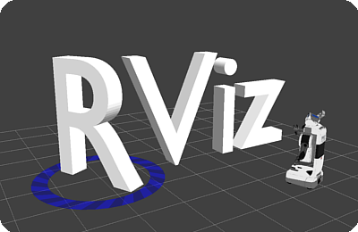

# ROS2X

[English](README.md) | [繁體中文](README.zh-TW.md)

[](LICENSE)
[-22314E.svg)](https://docs.ros.org/en/humble/index.html)
[](https://docs.docker.com/compose/)
[](#相容性)
[](ROS2X)

ROS2X 是一個以 Docker 為優先的 ROS 2 開發工具箱，重點在可重現且適合機器人開發的工作流程。
它提供單一入口腳本，可處理映像建置、工作區建置、啟動/執行、micro-ROS 初始化與內建 app 啟動流程。

<table>
  <tr>
    <td align="center" width="220">
      <a href="https://foxglove.dev">
        
      </a>
    </td>
    <td align="center" width="220">
      <a href="https://docs.ros.org/en/humble/Tutorials/Intermediate/RViz/RViz-User-Guide/RViz-User-Guide.html">
        
      </a>
    </td>
    <td align="center" width="220">
      <a href="https://gazebosim.org/docs/fortress/">
        
      </a>
    </td>
    <td align="center" width="220">
      <a href="https://www.behaviortree.dev/groot/">
        
      </a>
    </td>
    <td align="center" width="220">
      <a href="https://qgroundcontrol.com/">
        
      </a>
    </td>
  </tr>
  <tr>
    <td align="center"><code>./ROS2X bridge</code></td>
    <td align="center"><code>./ROS2X rviz</code></td>
    <td align="center"><code>./ROS2X gazebo</code></td>
    <td align="center"><code>./ROS2X app groot</code></td>
    <td align="center"><code>./ROS2X app qgc</code></td>
  </tr>
</table>

## 特色

- Ubuntu 22.04 基底映像（`docker/Dockerfile`）
- 依主機 UID/GID 映射，確保檔案擁有權正確
- 提供 X11 GUI 支援，可使用 RViz 與 AppImage 工具
- 內建 micro-ROS 初始化流程（`scripts/install_micro_ros.sh`）
- 內建 app 啟動器：Foxglove Bridge, RViz2, Gazebo, Groot2 and QGroundControl
- 透過 `config/ros2x.conf` 保存專案設定

## 快速開始

```bash
./ROS2X --help
./ROS2X config init
./ROS2X build
./ROS2X enter
```

## 指令對照

| 指令 | 用途 |
|---|---|
| `./ROS2X build` | 在容器內建置工作區（`colcon build --symlink-install`） |
| `./ROS2X run` | 執行 `LAUNCH_COMMAND`（若尚未建置會自動先建置） |
| `./ROS2X bridge` | 啟動 Foxglove Bridge |
| `./ROS2X rviz` | 啟動 RViz2 |
| `./ROS2X gazebo` | 啟動 Gazebo（`ros2 launch ros_gz_sim gz_sim.launch.py`） |
| `./ROS2X app groot` | 啟動 Groot2 AppImage |
| `./ROS2X app qgroundcontrol` | 啟動 QGroundControl AppImage |
| `./ROS2X enter` | 進入執行中的容器 shell |
| `./ROS2X --command "<cmd>"` | 在容器中執行單一命令 |
| `./ROS2X image-build` | 僅建置/更新 Docker 映像 |
| `./ROS2X close` | 停止容器 |
| `./ROS2X config ...` | 顯示或管理持久化設定 |

## 設定

`./ROS2X` 每次執行都會寫入 `docker/.env`。
請勿直接編輯 `docker/.env`。

建議設定方式：

1. 單次命令：
   `ROS_DISTRO=humble ROS_INSTALL_TYPE=desktop ./ROS2X build`
2. 專案持久化預設值：
   `./ROS2X config set <KEY> <VALUE>`

優先順序：
`inline env vars > config/ros2x.conf > script defaults`

常用設定指令：

```bash
./ROS2X config init
./ROS2X config list
./ROS2X config keys
./ROS2X config get ROS_DISTRO
./ROS2X config set INSTALL_MICRO_ROS true
./ROS2X config unset GROOT_SHA256
```

主要鍵值：

- `ROS_DISTRO`（預設：`humble`）
- `ROS_INSTALL_TYPE`（`ros-base|desktop|development`，預設：`ros-base`）
- `ROS_DOMAIN_ID`（預設：`0`）
- `PROJECT_NAME`（預設：`ros2x`）
- `INSTALL_MICRO_ROS`（預設：`false`）
- `LAUNCH_COMMAND`
- `IMAGE_NAME`（預設：`ghcr.io/seanchangx/ros2x:${ROS_DISTRO}-<flavor>`）
  - flavor 對應：`ros-base -> base`、`desktop -> desktop`、`development -> dev`
- `IMAGE_STRATEGY`（`auto|pull|build`，預設：`auto`）
- `GROOT_VERSION`、`GROOT_FALLBACK_VERSIONS`、`GROOT_APPIMAGE_URL`、`GROOT_SHA256`
- `QGC_VERSION`（`latest` 或如 `5.0.8`）、`QGC_APPIMAGE_URL`、`QGC_SHA256`
- `FOXGLOVE_PORT`（預設：`8765`）、`FOXGLOVE_ADDRESS`（預設：`0.0.0.0`）

## 小工具範例

可用 `--command` 個別啟動每個小工具：

```bash
./ROS2X --command "ros2 launch rosbridge_server rosbridge_websocket_launch.xml"
```

```bash
./ROS2X --command "ros2 launch teleop_twist_joy teleop-launch.py joy_config:=xbox joy_vel:=cmd_vel"
```

```bash
./ROS2X --command "ros2 run image_tools cam2image --ros-args --log-level WARN -p video_device:=/dev/video0"
```

## micro-ROS 工作流程

啟用 micro-ROS 初始化並建置：

```bash
./ROS2X config set INSTALL_MICRO_ROS true
./ROS2X build
```

執行 agent 範例：

```bash
./ROS2X --command "ros2 run micro_ros_agent micro_ros_agent serial --dev /dev/ttyUSB0 -b 115200 -v6"
```

## Foxglove Bridge

```bash
./ROS2X bridge
```

自訂綁定位址：

```bash
./ROS2X config set FOXGLOVE_ADDRESS 0.0.0.0
./ROS2X config set FOXGLOVE_PORT 8765
./ROS2X bridge
```

## RViz2

```bash
./ROS2X rviz
```

## Gazebo

```bash
./ROS2X gazebo
```

## Groot2

```bash
./ROS2X app groot
```

AppImage 目標路徑：
`apps/groot/groot.AppImage`

## QGroundControl

```bash
./ROS2X app qgroundcontrol
```

AppImage 目標路徑：
`apps/qgroundcontrol/qgroundcontrol.AppImage`

## 執行行為

1. `ROS2X` 解析設定並寫入 compose 環境變數。
2. `image-build` 只建置映像。
3. `build` 在容器內進行工作區建置。
   - 若 `INSTALL_MICRO_ROS=true`，會先做初始化，再進行工作區建置。
4. `run` 僅在工作區未建置時自動建置，之後執行 `LAUNCH_COMMAND`。
5. `bridge`、`rviz`、`gazebo`、`app groot` 與 `app qgroundcontrol` 在程式結束後都會保留容器。
   需要停止時請手動執行 `./ROS2X close`。

## 相容性

- 主機作業系統：Linux（需要 Docker Engine + Docker Compose v2）
- CPU 架構：`x86_64`、`aarch64`
- ROS 發行版：
  - 腳本支援可設定的 distro 值。
  - Docker 映像基於 Ubuntu 22.04，因此以對齊 Jammy 的發行版為主要路徑。
- 此 repo 的預設設定未將 macOS 與 Windows 視為一級目標平台。

## 原生安裝（可選）

在 Ubuntu 上也可於 Docker 外使用同一份安裝腳本：

```bash
chmod +x scripts/install_ros2.sh
./scripts/install_ros2.sh --ros-distro humble --install-type development
```

常用旗標：

- `--non-interactive`
- `--configure-bashrc yes|no|ask`
- `--skip-upgrade`
- `--no-install-recommends`
- `--allow-root`
- `--force-unsupported`

## 專案結構

```text
ROS2X
├── ROS2X
├── docker
│   ├── Dockerfile
│   ├── docker-compose.yaml
│   ├── entrypoint.sh
│   └── .bashrc
├── apps
│   ├── gazebo
│   ├── groot
│   └── qgroundcontrol
├── ros2_ws
│   └── src
├── config
│   └── ros2x.conf.example
└── scripts
    ├── install_ros2.sh
    ├── install_micro_ros.sh
    ├── install_groot2.sh
    └── install_qgroundcontrol.sh
```

## 注意事項

- 為機器人使用情境，已啟用 `network_mode: host` 與 `privileged: true`。
- 若不需硬體 passthrough，建議相應收斂容器權限。
- 多機器人區網情境下，請分配不同的 `ROS_DOMAIN_ID`。
